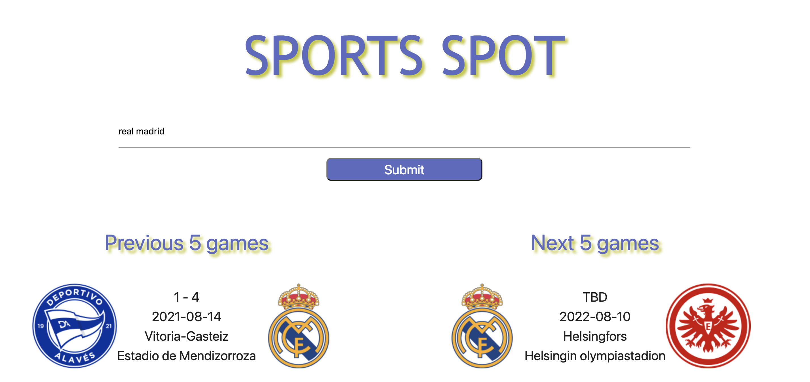
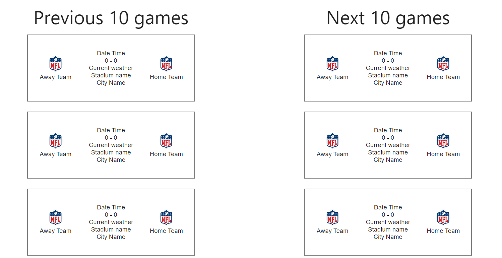
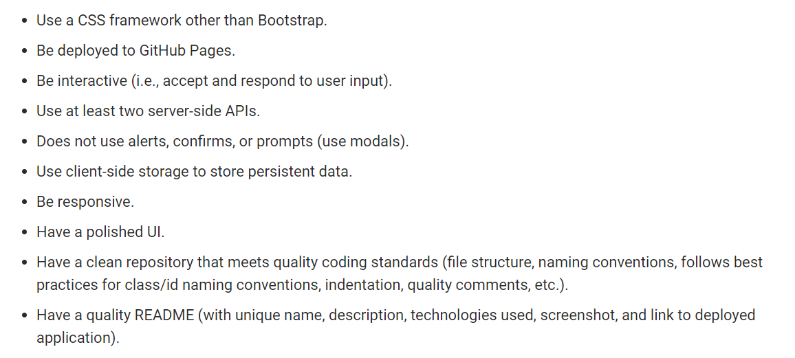

## Module 07: Sports Spot

 
<!--   -->

### Project Mock-up

### Current Project State

* [Project-state](https://github.com/abdallahamdy/sports-spot/issues)

### Project Resources
* css
        - [style](./assets/css/style.css)
* css external resources
        - [materialize](./assets/css/materialize.css)
        - [materialize-min](./assets/css/materialize.min.css)
* images
        - [Background-Title](./assets/images/8cGbezaXi.jpg)
* images external resources
        - [Background-Title](./assets/images/8cGbezaXi.jpg)
* js
        - [script]()
* js external resources
        - [materialize](./assets/js/materialize.js)
        - [materialize-min](./assets/js/materialize.min.js)
* html
        - [index](/index.html)

### Project outside Resources used
* css responsive front-end framework
        - [materialize-css-js](https://materializecss.com/)
* images
        - [clipart-library](http://clipart-library.com/clipart/8cGbezaXi.htm)
* js
        - [materialize-css-js](https://materializecss.com/)

## Sports Spot Web page and all resources

Our Sports Spot website [this is the link](https://github.io/abdallahamdy/sports-spot) 
You can have access to the resources on our Sports Spot Web Page [this is the link](https://github.com/abdallahamdy/sports-spot) 

## The Web Developer for Sports Spot are:

* Ibrahim Imran
* Abdalla Hamdy
* Miguel Jerome
